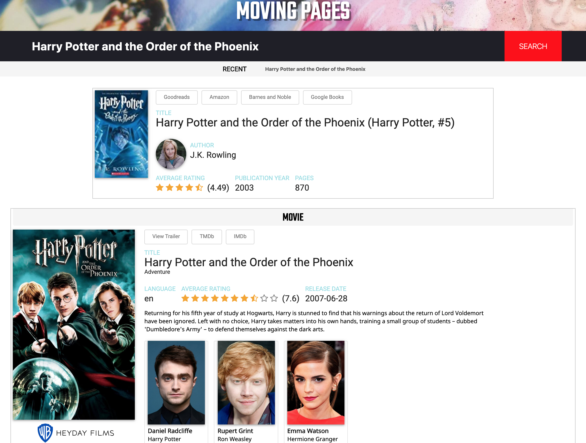
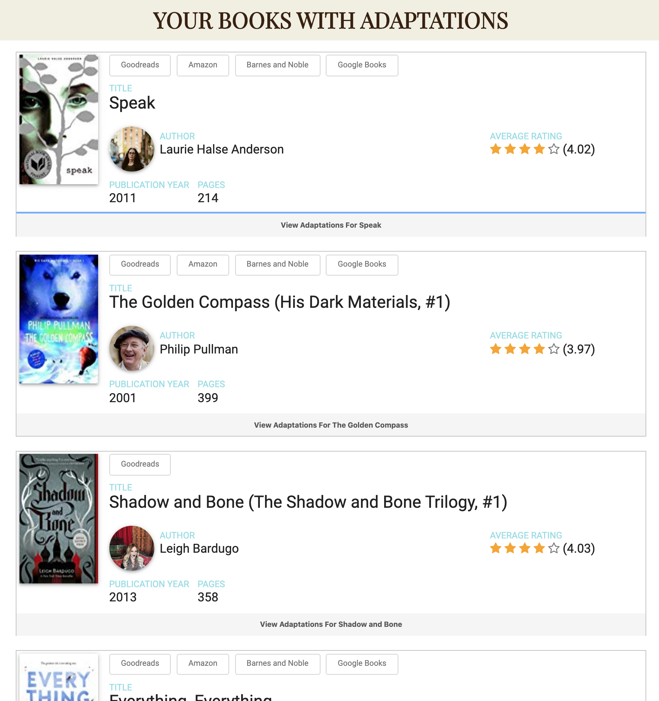

#Moving Pages
By Luis Riveron

Moving pages is used to find screen adaptations for books.

Often after reading a book, the reader might want to know if any screen adaptations exist based on what they just read. An answer to this question should be just a simple search ahead.

Moving Pages offers three ways to discover book to screen adaptations:
1. Searching by book name.
2. Connecting to their Goodreads.com account via OAuth.
3. Searching for a random book by clicking the "Random Book" button.

By connecting their Goodreads.com account to Moving Pages, the user saves time by not having to manually search every single book on their 'Read List' one at a time.
Moving Pages does all the work by matching books from the users 'Read List' to screen adaptations.

##Index Page

##Result Page

##User Read Books Results

##Built With
- Python, Flask
- HTML5, CSS3, Sass
- Javascript

###API Used
- Goodreads.com
- TheMovieDB.org